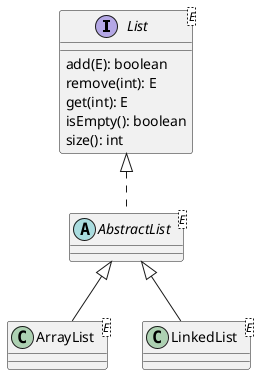

# Fenced code blocks with PlantUML source code in Markdown code

## Example 1 - rendered



## Example 2 - not rendered

```
@startuml

 title: Links in diagrams

 class FluentPreview [[../../plugin/src/net/certiv/fluentmark/views/FluentPreview.java]]
 interface List [[https://docs.oracle.com/en/java/javase/18/docs/api/java.base/java/util/List.html]]

 FluentPreview -> ViewPart

@enduml
```